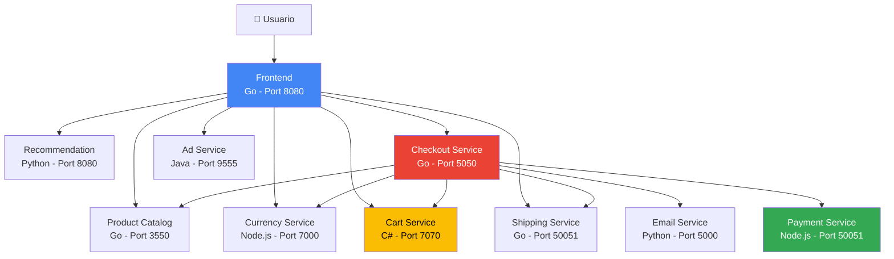
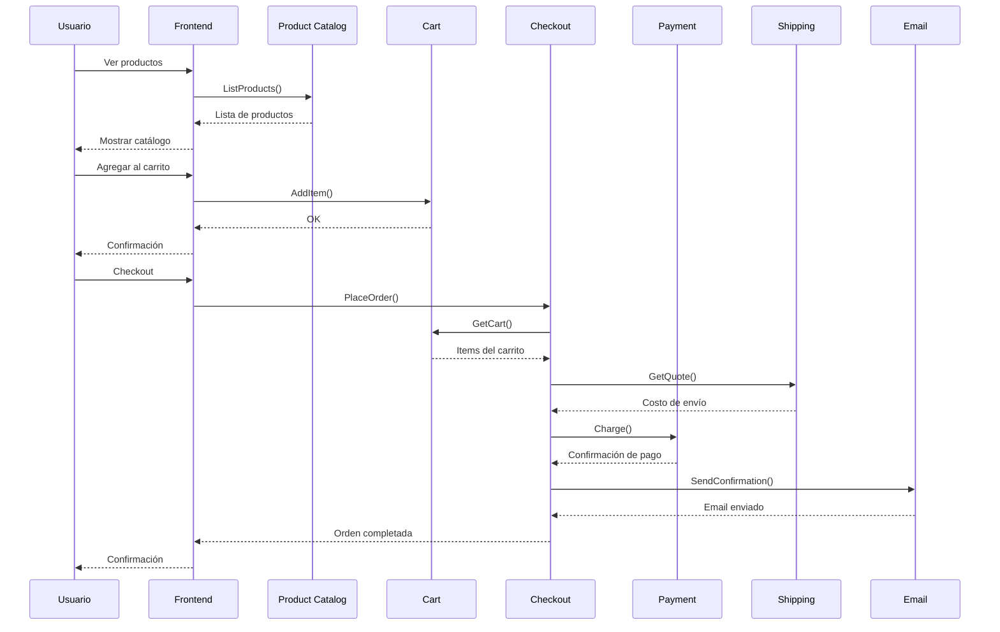

# Arquitectura de Online Boutique

## Visión General

Online Boutique es una aplicación de e-commerce basada en **microservicios** que demuestra las mejores prácticas de arquitectura moderna y DevOps.

## Diagrama de Arquitectura



## Microservicios

### 1. Frontend (Go)

**Responsabilidad**: Interfaz web del usuario

**Puerto**: 8080

**Tecnología**: Go + HTML templates

**Funcionalidades**:
- Catálogo de productos
- Carrito de compras
- Proceso de checkout
- Visualización de recomendaciones
- Anuncios

**Dependencias**:
- Product Catalog Service
- Currency Service
- Cart Service
- Recommendation Service
- Shipping Service
- Checkout Service
- Ad Service

**Health Check**: `GET /_healthz`

---

### 2. Product Catalog Service (Go)

**Responsabilidad**: Gestión del catálogo de productos

**Puerto**: 3550

**Tecnología**: Go + gRPC

**Funcionalidades**:
- Listar productos
- Buscar productos
- Obtener detalles de producto

**Datos**: JSON file con productos

**API**:
```protobuf
service ProductCatalogService {
  rpc ListProducts(Empty) returns (ListProductsResponse);
  rpc GetProduct(GetProductRequest) returns (Product);
  rpc SearchProducts(SearchProductsRequest) returns (SearchProductsResponse);
}
```

---

### 3. Cart Service (C#)

**Responsabilidad**: Gestión del carrito de compras

**Puerto**: 7070

**Tecnología**: C# + gRPC + Redis

**Funcionalidades**:
- Agregar items al carrito
- Ver carrito
- Vaciar carrito

**Almacenamiento**: Redis (in-memory)

**API**:
```protobuf
service CartService {
  rpc AddItem(AddItemRequest) returns (Empty);
  rpc GetCart(GetCartRequest) returns (Cart);
  rpc EmptyCart(EmptyCartRequest) returns (Empty);
}
```

---

### 4. Currency Service (Node.js)

**Responsabilidad**: Conversión de monedas

**Puerto**: 7000

**Tecnología**: Node.js + gRPC

**Funcionalidades**:
- Listar monedas soportadas
- Convertir entre monedas

**Monedas**: USD, EUR, JPY, GBP, CAD, etc.

**API**:
```protobuf
service CurrencyService {
  rpc GetSupportedCurrencies(Empty) returns (GetSupportedCurrenciesResponse);
  rpc Convert(CurrencyConversionRequest) returns (Money);
}
```

---

### 5. Payment Service (Node.js)

**Responsabilidad**: Procesamiento de pagos

**Puerto**: 50051

**Tecnología**: Node.js + gRPC

**Funcionalidades**:
- Procesar pago con tarjeta de crédito (simulado)

**API**:
```protobuf
service PaymentService {
  rpc Charge(ChargeRequest) returns (ChargeResponse);
}
```

---

### 6. Shipping Service (Go)

**Responsabilidad**: Cálculo de costos de envío

**Puerto**: 50051

**Tecnología**: Go + gRPC

**Funcionalidades**:
- Obtener cotización de envío
- Enviar orden

**API**:
```protobuf
service ShippingService {
  rpc GetQuote(GetQuoteRequest) returns (GetQuoteResponse);
  rpc ShipOrder(ShipOrderRequest) returns (ShipOrderResponse);
}
```

---

### 7. Email Service (Python)

**Responsabilidad**: Envío de confirmaciones por email

**Puerto**: 5000

**Tecnología**: Python + gRPC

**Funcionalidades**:
- Enviar confirmación de orden (simulado)

**API**:
```protobuf
service EmailService {
  rpc SendOrderConfirmation(SendOrderConfirmationRequest) returns (Empty);
}
```

---

### 8. Checkout Service (Go)

**Responsabilidad**: Orquestación del proceso de checkout

**Puerto**: 5050

**Tecnología**: Go + gRPC

**Funcionalidades**:
- Procesar orden completa
- Coordinar múltiples servicios

**Dependencias**:
- Cart Service
- Product Catalog Service
- Currency Service
- Shipping Service
- Payment Service
- Email Service

**API**:
```protobuf
service CheckoutService {
  rpc PlaceOrder(PlaceOrderRequest) returns (PlaceOrderResponse);
}
```

---

### 9. Recommendation Service (Python)

**Responsabilidad**: Recomendaciones de productos

**Puerto**: 8080

**Tecnología**: Python + gRPC

**Funcionalidades**:
- Generar recomendaciones basadas en productos del carrito

**API**:
```protobuf
service RecommendationService {
  rpc ListRecommendations(ListRecommendationsRequest) returns (ListRecommendationsResponse);
}
```

---

### 10. Ad Service (Java)

**Responsabilidad**: Servicio de anuncios

**Puerto**: 9555

**Tecnología**: Java + gRPC

**Funcionalidades**:
- Obtener anuncios basados en contexto

**API**:
```protobuf
service AdService {
  rpc GetAds(AdRequest) returns (AdResponse);
}
```

---

### 11. Load Generator (Python)

**Responsabilidad**: Generación de tráfico sintético

**Tecnología**: Python + Locust

**Funcionalidades**:
- Simular usuarios navegando
- Simular compras
- Generar carga para pruebas

---

## Patrones de Arquitectura

### 1. Microservicios

**Beneficios**:
- ✅ Despliegue independiente
- ✅ Escalado granular
- ✅ Tecnologías heterogéneas
- ✅ Equipos autónomos

**Desafíos**:
- ⚠️ Complejidad de red
- ⚠️ Transacciones distribuidas
- ⚠️ Monitoreo complejo

### 2. API Gateway Pattern

El **Frontend** actúa como API Gateway:
- Punto de entrada único
- Enrutamiento a servicios backend
- Agregación de respuestas

### 3. Service Mesh (Implícito)

Comunicación entre servicios:
- gRPC para comunicación interna
- HTTP/REST para frontend
- Service discovery vía Kubernetes DNS

### 4. Circuit Breaker

Implementado en servicios críticos:
- Timeout en llamadas gRPC
- Retry logic
- Fallback responses

## Comunicación entre Servicios

### Protocolos

| Comunicación | Protocolo | Puerto |
|--------------|-----------|--------|
| Usuario → Frontend | HTTP/1.1 | 8080 |
| Frontend → Servicios | gRPC | Varios |
| Servicios → Servicios | gRPC | Varios |

### Service Discovery

Kubernetes DNS interno:
```
<service-name>.<namespace>.svc.cluster.local
```

Ejemplo:
```
cartservice.online-boutique-dev.svc.cluster.local:7070
```

Simplificado (mismo namespace):
```
cartservice:7070
```

## Recursos de Kubernetes

### Deployments

Cada microservicio tiene su propio Deployment:

```yaml
apiVersion: apps/v1
kind: Deployment
metadata:
  name: frontend
spec:
  replicas: 1
  template:
    spec:
      containers:
      - name: frontend
        image: ghcr.io/fernandot8rres/frontend:main
        ports:
        - containerPort: 8080
```

### Services

Cada microservicio expone un Service:

```yaml
apiVersion: v1
kind: Service
metadata:
  name: frontend
spec:
  type: NodePort
  ports:
  - port: 80
    targetPort: 8080
  selector:
    app: frontend
```

### ConfigMaps

Configuración centralizada:

```yaml
apiVersion: v1
kind: ConfigMap
metadata:
  name: online-boutique-config
data:
  PRODUCT_CATALOG_SERVICE_ADDR: "productcatalogservice:3550"
  CART_SERVICE_ADDR: "cartservice:7070"
```

## Flujo de una Compra



## Seguridad

### 1. Network Policies

Restricción de comunicación entre pods:

```yaml
apiVersion: networking.k8s.io/v1
kind: NetworkPolicy
metadata:
  name: frontend-policy
spec:
  podSelector:
    matchLabels:
      app: frontend
  ingress:
  - from:
    - podSelector: {}
```

### 2. Security Context

Contenedores no privilegiados:

```yaml
securityContext:
  runAsNonRoot: true
  runAsUser: 1000
  allowPrivilegeEscalation: false
```

### 3. Resource Limits

Prevención de resource exhaustion:

```yaml
resources:
  limits:
    cpu: 200m
    memory: 256Mi
  requests:
    cpu: 100m
    memory: 128Mi
```

## Observabilidad

### Logs

Cada servicio escribe logs a stdout/stderr:

```bash
kubectl logs -n online-boutique-dev deployment/frontend
```

### Health Checks

- **Liveness**: ¿El contenedor está vivo?
- **Readiness**: ¿El contenedor está listo?

```yaml
livenessProbe:
  httpGet:
    path: /_healthz
    port: 8080
readinessProbe:
  httpGet:
    path: /_healthz
    port: 8080
```

### Metrics (Futuro)

- Prometheus para métricas
- Grafana para visualización
- Jaeger para tracing distribuido

## Escalabilidad

### Horizontal Pod Autoscaling

```bash
kubectl autoscale deployment frontend \
  --cpu-percent=50 \
  --min=1 \
  --max=10 \
  -n online-boutique-dev
```

### Vertical Scaling

Ajustar recursos por servicio en `values.yaml`:

```yaml
services:
  frontend:
    resources:
      limits:
        cpu: 500m
        memory: 512Mi
```

## Resiliencia

### 1. Múltiples Réplicas

Producción usa 2+ réplicas:

```yaml
services:
  frontend:
    replicas: 2
```

### 2. Rolling Updates

Despliegue sin downtime:

```yaml
strategy:
  type: RollingUpdate
  rollingUpdate:
    maxSurge: 1
    maxUnavailable: 0
```

### 3. Health Checks

Kubernetes reinicia pods no saludables automáticamente.

## Tecnologías por Servicio

| Servicio | Lenguaje | Framework | Protocolo |
|----------|----------|-----------|-----------|
| Frontend | Go | net/http | HTTP |
| Product Catalog | Go | gRPC | gRPC |
| Cart | C# | ASP.NET Core | gRPC |
| Currency | Node.js | @grpc/grpc-js | gRPC |
| Payment | Node.js | @grpc/grpc-js | gRPC |
| Shipping | Go | gRPC | gRPC |
| Email | Python | grpcio | gRPC |
| Checkout | Go | gRPC | gRPC |
| Recommendation | Python | grpcio | gRPC |
| Ad | Java | gRPC-Java | gRPC |

## Conclusión

Online Boutique demuestra:

- ✅ Arquitectura de microservicios moderna
- ✅ Comunicación eficiente con gRPC
- ✅ Despliegue en Kubernetes
- ✅ Múltiples lenguajes de programación
- ✅ Patrones de resiliencia
- ✅ Observabilidad integrada

Es un excelente ejemplo para aprender DevOps y arquitecturas cloud-native.
