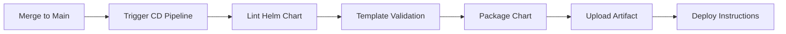

# Proceso de Despliegue Continuo (CD)

## Objetivo

Automatizar el despliegue de Online Boutique en Kubernetes utilizando Helm Charts.

## Tecnologías Utilizadas

- **GitHub Actions**: Plataforma de CI/CD
- **Helm**: Gestor de paquetes para Kubernetes
- **Kubernetes (Minikube)**: Orquestador de contenedores
- **kubectl**: CLI de Kubernetes

## Arquitectura del Pipeline CD



## Pipeline: `.github/workflows/cd-deploy-k8s.yml`

### Triggers

El pipeline se ejecuta en:

- ✅ Push a rama `main`
- ✅ Manual dispatch (workflow_dispatch)

### Pasos del Pipeline

#### 1. Checkout del Repositorio

```yaml
- name: Checkout repository
  uses: actions/checkout@v4
```

#### 2. Determinar Ambiente

```yaml
- name: Set environment
  run: |
    if [ "${{ github.event_name }}" == "workflow_dispatch" ]; then
      echo "ENVIRONMENT=${{ github.event.inputs.environment }}" >> $GITHUB_ENV
    else
      echo "ENVIRONMENT=dev" >> $GITHUB_ENV
    fi
```

**Ambientes**:
- `dev`: Desarrollo (por defecto en push a main)
- `prod`: Producción (solo manual)

#### 3. Lint del Helm Chart

```yaml
- name: Lint Helm Chart
  run: |
    helm lint ./helm-chart \
      --values ./helm-chart/${{ env.VALUES_FILE }}
```

**Valida**:
- ✅ Sintaxis YAML correcta
- ✅ Templates válidos
- ✅ Referencias correctas
- ✅ Valores requeridos presentes

#### 4. Template del Chart

```yaml
- name: Template Helm Chart
  run: |
    helm template online-boutique ./helm-chart \
      --values ./helm-chart/${{ env.VALUES_FILE }} \
      --namespace online-boutique-${{ env.ENVIRONMENT }} \
      --debug > /tmp/manifests.yaml
```

**Genera**:
- Manifiestos de Kubernetes renderizados
- Preview de recursos a crear
- Validación de templates

#### 5. Empaquetar Chart

```yaml
- name: Package Helm Chart
  run: |
    helm package ./helm-chart \
      --destination ./helm-packages \
      --version 1.0.${{ github.run_number }}
```

**Crea**: `online-boutique-1.0.<run_number>.tgz`

#### 6. Upload de Artifact

```yaml
- name: Upload Helm Package
  uses: actions/upload-artifact@v4
  with:
    name: helm-chart-${{ env.ENVIRONMENT }}
    path: ./helm-packages/*.tgz
```

El chart empaquetado está disponible para descarga por 30 días.

## Helm Chart Personalizado

### Estructura

```
helm-chart/
├── Chart.yaml                 # Metadata del chart
├── values.yaml               # Valores por defecto
├── values-dev.yaml          # Valores de desarrollo
├── values-prod.yaml         # Valores de producción
└── templates/
    ├── _helpers.tpl         # Helpers reutilizables
    ├── deployments/
    │   ├── frontend.yaml    # Deployment de frontend
    │   └── microservices.yaml  # Deployments de backend
    └── services/
        ├── frontend.yaml    # Service de frontend
        └── microservices.yaml  # Services de backend
```

### Configuración por Ambiente

#### Desarrollo (`values-dev.yaml`)

```yaml
global:
  imageTag: develop

namespace: online-boutique-dev

services:
  frontend:
    replicas: 1
    type: NodePort
```

**Características**:
- 1 réplica por servicio
- NodePort para acceso fácil
- Sin load generator

#### Producción (`values-prod.yaml`)

```yaml
global:
  imageTag: main

namespace: online-boutique-prod

services:
  frontend:
    replicas: 2
  
  cartservice:
    replicas: 2
```

**Características**:
- 2+ réplicas para alta disponibilidad
- LoadBalancer para frontend
- Load generator habilitado

## Despliegue Manual con Helm

### Prerrequisitos

```bash
# Verificar que Minikube esté corriendo
minikube status

# Verificar que Terraform haya creado la infraestructura
kubectl get namespace | grep online-boutique
```

### Despliegue en Desarrollo

```bash
# Instalar/actualizar el chart
helm upgrade --install online-boutique ./helm-chart \
  --values ./helm-chart/values-dev.yaml \
  --namespace online-boutique-dev \
  --create-namespace \
  --wait \
  --timeout 5m

# Verificar despliegue
kubectl get pods -n online-boutique-dev

# Esperar a que todos estén Running
kubectl wait --for=condition=ready pod \
  --all \
  -n online-boutique-dev \
  --timeout=300s
```

### Despliegue en Producción

```bash
helm upgrade --install online-boutique ./helm-chart \
  --values ./helm-chart/values-prod.yaml \
  --namespace online-boutique-prod \
  --create-namespace \
  --wait \
  --timeout 10m
```

## Acceso a la Aplicación

### Opción 1: Minikube Service (Recomendado)

```bash
# Abrir frontend en navegador
minikube service frontend -n online-boutique-dev

# Ver URL sin abrir navegador
minikube service frontend -n online-boutique-dev --url
```

**Salida esperada**:
```
http://192.168.49.2:30080
```

### Opción 2: Port Forward

```bash
# Forward del puerto
kubectl port-forward -n online-boutique-dev svc/frontend 8080:80

# Abrir en navegador
open http://localhost:8080
```

### Opción 3: Minikube Tunnel (LoadBalancer)

```bash
# Iniciar tunnel (requiere sudo)
minikube tunnel

# En otra terminal, obtener IP externa
kubectl get svc frontend -n online-boutique-dev
```

## Verificación del Despliegue

### 1. Verificar Pods

```bash
# Ver todos los pods
kubectl get pods -n online-boutique-dev

# Salida esperada (todos Running):
NAME                                     READY   STATUS    RESTARTS
adservice-xxx                           1/1     Running   0
cartservice-xxx                         1/1     Running   0
checkoutservice-xxx                     1/1     Running   0
currencyservice-xxx                     1/1     Running   0
emailservice-xxx                        1/1     Running   0
frontend-xxx                            1/1     Running   0
paymentservice-xxx                      1/1     Running   0
productcatalogservice-xxx               1/1     Running   0
recommendationservice-xxx               1/1     Running   0
shippingservice-xxx                     1/1     Running   0
```

### 2. Verificar Services

```bash
kubectl get services -n online-boutique-dev
```

### 3. Ver Logs

```bash
# Logs del frontend
kubectl logs -n online-boutique-dev deployment/frontend --tail=50

# Logs de todos los pods
kubectl logs -n online-boutique-dev --all-containers=true --tail=20
```

### 4. Describir Recursos

```bash
# Describir un pod
kubectl describe pod -n online-boutique-dev <pod-name>

# Ver eventos del namespace
kubectl get events -n online-boutique-dev --sort-by='.lastTimestamp'
```

## Actualización de la Aplicación

### Actualizar con Nuevas Imágenes

```bash
# Actualizar tag de imagen en values
helm upgrade online-boutique ./helm-chart \
  --values ./helm-chart/values-dev.yaml \
  --set global.imageTag=main-abc1234 \
  --namespace online-boutique-dev
```

### Rollback a Versión Anterior

```bash
# Ver historial de releases
helm history online-boutique -n online-boutique-dev

# Rollback a revisión anterior
helm rollback online-boutique -n online-boutique-dev

# Rollback a revisión específica
helm rollback online-boutique 2 -n online-boutique-dev
```

## Escalado de Servicios

### Escalar Manualmente

```bash
# Escalar frontend a 3 réplicas
kubectl scale deployment frontend \
  --replicas=3 \
  -n online-boutique-dev

# Verificar
kubectl get deployment frontend -n online-boutique-dev
```

### Escalar con Helm

```bash
# Actualizar values
helm upgrade online-boutique ./helm-chart \
  --values ./helm-chart/values-dev.yaml \
  --set services.frontend.replicas=3 \
  --namespace online-boutique-dev
```

## Health Checks

### Liveness Probes

Verifican que el contenedor esté vivo:

```yaml
livenessProbe:
  httpGet:
    path: /_healthz
    port: 8080
  initialDelaySeconds: 10
  periodSeconds: 10
```

### Readiness Probes

Verifican que el contenedor esté listo para recibir tráfico:

```yaml
readinessProbe:
  httpGet:
    path: /_healthz
    port: 8080
  initialDelaySeconds: 10
  periodSeconds: 10
```

## Resource Limits

Cada pod tiene límites configurados:

```yaml
resources:
  limits:
    cpu: 200m
    memory: 256Mi
  requests:
    cpu: 100m
    memory: 128Mi
```

**Beneficios**:
- ✅ Previene que un pod consuma todos los recursos
- ✅ Permite scheduling eficiente
- ✅ Mejora estabilidad del cluster

## Troubleshooting

### Pod en estado CrashLoopBackOff

```bash
# Ver logs del pod
kubectl logs -n online-boutique-dev <pod-name> --previous

# Describir pod para ver eventos
kubectl describe pod -n online-boutique-dev <pod-name>
```

**Causas comunes**:
- Imagen no disponible
- Variables de entorno incorrectas
- Dependencias no disponibles

### Pod en estado Pending

```bash
# Ver eventos
kubectl describe pod -n online-boutique-dev <pod-name>
```

**Causas comunes**:
- Recursos insuficientes en Minikube
- PersistentVolume no disponible
- Node selector no coincide

### Service no accesible

```bash
# Verificar endpoints
kubectl get endpoints -n online-boutique-dev

# Verificar que los pods estén Ready
kubectl get pods -n online-boutique-dev
```

## Limpieza

### Desinstalar Chart

```bash
# Desinstalar release
helm uninstall online-boutique -n online-boutique-dev

# Eliminar namespace
kubectl delete namespace online-boutique-dev
```

### Limpiar Minikube

```bash
# Detener Minikube
minikube stop

# Eliminar cluster
minikube delete
```

## Métricas de Éxito

| Métrica | Objetivo | Verificación |
|---------|----------|--------------|
| Tiempo de despliegue | < 5 min | `helm upgrade --wait` |
| Pods en Running | 100% | `kubectl get pods` |
| Health checks | Passing | `kubectl describe pod` |
| Tiempo de respuesta | < 2s | Acceder a frontend |

## Próximos Pasos

1. ✅ Configurar monitoreo con Prometheus/Grafana
2. ✅ Implementar logging centralizado
3. ✅ Configurar alertas
4. ✅ Implementar auto-scaling

Ver: [Arquitectura](./arquitectura.md)
