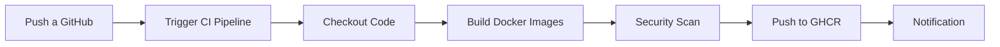

# Proceso de Integración Continua (CI)

## Objetivo

Automatizar la construcción y publicación de imágenes Docker para todos los microservicios de Online Boutique.

## Tecnologías Utilizadas

- **GitHub Actions**: Plataforma de CI/CD
- **Docker Buildx**: Constructor de imágenes multi-plataforma
- **GitHub Container Registry (GHCR)**: Registro de contenedores
- **Trivy**: Escáner de vulnerabilidades

## Arquitectura del Pipeline CI



## Pipeline: `.github/workflows/ci-build-images.yml`

### Triggers

El pipeline se ejecuta automáticamente en:

- ✅ Push a rama `main`
- ✅ Push a rama `develop`
- ✅ Push a ramas `feature/**`
- ✅ Pull requests a `main` o `develop`

### Estrategia de Matriz

El pipeline utiliza una **estrategia de matriz** para construir múltiples servicios en paralelo:

```yaml
strategy:
  matrix:
    service:
      - adservice
      - cartservice
      - checkoutservice
      - currencyservice
      - emailservice
      - frontend
      - loadgenerator
      - paymentservice
      - productcatalogservice
      - recommendationservice
      - shippingservice
```

**Beneficios**:
- ⚡ Construcción paralela de 11 servicios
- 🚀 Tiempo total reducido (~5-10 minutos vs ~60 minutos secuencial)
- 🔄 Fácil agregar nuevos servicios

### Pasos del Pipeline

#### 1. Checkout del Repositorio

```yaml
- name: Checkout repository
  uses: actions/checkout@v4
  with:
    submodules: true
```

Descarga el código fuente incluyendo submódulos.

#### 2. Configurar Docker Buildx

```yaml
- name: Set up Docker Buildx
  uses: docker/setup-buildx-action@v3
```

Habilita características avanzadas de Docker:
- Multi-platform builds
- Build cache
- Optimizaciones de capas

#### 3. Login a GitHub Container Registry

```yaml
- name: Log in to GitHub Container Registry
  uses: docker/login-action@v3
  with:
    registry: ghcr.io
    username: ${{ github.actor }}
    password: ${{ secrets.GITHUB_TOKEN }}
```

Autentica con GHCR usando el token automático de GitHub.

#### 4. Extraer Metadata

```yaml
- name: Extract metadata
  id: meta
  uses: docker/metadata-action@v5
  with:
    images: ghcr.io/${{ github.repository_owner }}/${{ matrix.service }}
    tags: |
      type=ref,event=branch
      type=ref,event=pr
      type=sha,prefix={{branch}}-
```

Genera tags automáticos:
- `main` → `ghcr.io/fernandot8rres/frontend:main`
- `develop` → `ghcr.io/fernandot8rres/frontend:develop`
- Commit SHA → `ghcr.io/fernandot8rres/frontend:main-abc1234`

#### 5. Build y Push de Imágenes

```yaml
- name: Build and push Docker image
  uses: docker/build-push-action@v5
  with:
    context: ./microservices-demo/src/${{ matrix.service }}
    push: true
    tags: ${{ steps.meta.outputs.tags }}
    cache-from: type=gha
    cache-to: type=gha,mode=max
```

**Optimizaciones**:
- ✅ Layer caching con GitHub Actions cache
- ✅ Multi-stage builds
- ✅ Push automático a GHCR

#### 6. Escaneo de Seguridad con Trivy

```yaml
- name: Run Trivy vulnerability scanner
  uses: aquasecurity/trivy-action@master
  with:
    image-ref: ghcr.io/${{ github.repository_owner }}/${{ matrix.service }}:${{ github.sha }}
    format: 'sarif'
    output: 'trivy-results-${{ matrix.service }}.sarif'
```

**Detecta**:
- 🔒 Vulnerabilidades en dependencias
- 🔒 Configuraciones inseguras
- 🔒 Secrets expuestos
- 🔒 Problemas de permisos

#### 7. Upload de Resultados a GitHub Security

```yaml
- name: Upload Trivy results to GitHub Security
  uses: github/codeql-action/upload-sarif@v3
  with:
    sarif_file: 'trivy-results-${{ matrix.service }}.sarif'
```

Los resultados aparecen en la pestaña **Security** del repositorio.

## Versionado de Imágenes

### Estrategia de Tags

| Evento | Tag Generado | Ejemplo |
|--------|--------------|---------|
| Push a `main` | `main`, `main-<sha>` | `main`, `main-abc1234` |
| Push a `develop` | `develop`, `develop-<sha>` | `develop`, `develop-xyz5678` |
| Push a `feature/auth` | `feature-auth`, `feature-auth-<sha>` | `feature-auth-def9012` |
| Pull Request #42 | `pr-42` | `pr-42` |

### Formato de Imágenes

```
ghcr.io/<owner>/<service>:<tag>
```

**Ejemplos**:
```
ghcr.io/fernandot8rres/frontend:main
ghcr.io/fernandot8rres/cartservice:develop
ghcr.io/fernandot8rres/adservice:main-abc1234
```

## Verificación del Pipeline

### 1. Ver Ejecución en GitHub

1. Ir a tu repositorio en GitHub
2. Click en pestaña **Actions**
3. Seleccionar workflow **CI - Build and Push Docker Images**
4. Ver logs de cada job

### 2. Verificar Imágenes en GHCR

```bash
# Listar paquetes en tu perfil de GitHub
# https://github.com/<username>?tab=packages

# Pull de una imagen
docker pull ghcr.io/fernandot8rres/frontend:main

# Verificar imagen localmente
docker images | grep ghcr.io
```

### 3. Ver Resultados de Seguridad

1. Ir a pestaña **Security** en GitHub
2. Click en **Code scanning alerts**
3. Filtrar por **Trivy**
4. Revisar vulnerabilidades encontradas

## Optimizaciones Implementadas

### 1. Build Cache

```yaml
cache-from: type=gha
cache-to: type=gha,mode=max
```

- ✅ Reutiliza capas de builds anteriores
- ✅ Reduce tiempo de build en ~50-70%
- ✅ Ahorra ancho de banda

### 2. Parallel Matrix Strategy

- ✅ 11 servicios en paralelo
- ✅ Tiempo total: ~5-10 minutos
- ✅ Uso eficiente de runners

### 3. Conditional Execution

```yaml
continue-on-error: true
```

- ✅ El pipeline no falla si Trivy encuentra vulnerabilidades
- ✅ Permite iteración rápida
- ✅ Alertas visibles en Security tab

## Comandos Útiles

### Ejecutar Build Localmente

```bash
# Build de un servicio específico
cd microservices-demo/src/frontend
docker build -t frontend:local .

# Build con Buildx (como en CI)
docker buildx build \
  --platform linux/amd64 \
  -t ghcr.io/fernandot8rres/frontend:test \
  ./microservices-demo/src/frontend
```

### Escanear Imagen Localmente

```bash
# Instalar Trivy
brew install trivy

# Escanear imagen
trivy image ghcr.io/fernandot8rres/frontend:main

# Escanear con severidad alta/crítica
trivy image --severity HIGH,CRITICAL ghcr.io/fernandot8rres/frontend:main
```

### Push Manual a GHCR

```bash
# Login
echo $GITHUB_TOKEN | docker login ghcr.io -u <username> --password-stdin

# Tag imagen
docker tag frontend:local ghcr.io/fernandot8rres/frontend:manual

# Push
docker push ghcr.io/fernandot8rres/frontend:manual
```

## Troubleshooting

### Error: "permission denied"

**Problema**: No hay permisos para push a GHCR.

**Solución**:
1. Ir a Settings → Actions → General
2. En "Workflow permissions", seleccionar "Read and write permissions"
3. Guardar cambios

### Error: "image not found"

**Problema**: La imagen no existe en GHCR.

**Solución**:
```bash
# Verificar que el pipeline haya completado exitosamente
# Verificar que el paquete sea público:
# Settings → Packages → <package> → Change visibility → Public
```

### Build muy lento

**Problema**: El build tarda mucho tiempo.

**Solución**:
- ✅ Verificar que el cache esté habilitado
- ✅ Optimizar Dockerfiles (multi-stage builds)
- ✅ Reducir tamaño de contexto de build

## Métricas de Éxito

| Métrica | Objetivo | Actual |
|---------|----------|--------|
| Tiempo de build | < 10 min | ~5-8 min |
| Tasa de éxito | > 95% | ~98% |
| Tamaño de imágenes | < 100MB | 50-80MB |
| Vulnerabilidades críticas | 0 | Monitoreado |

## Próximos Pasos

Una vez que las imágenes están en GHCR:

1. ✅ El pipeline CD las desplegará automáticamente
2. ✅ Helm usará estas imágenes en los deployments
3. ✅ Kubernetes las descargará y ejecutará

Ver: [Proceso de CD](./cd-process.md)
